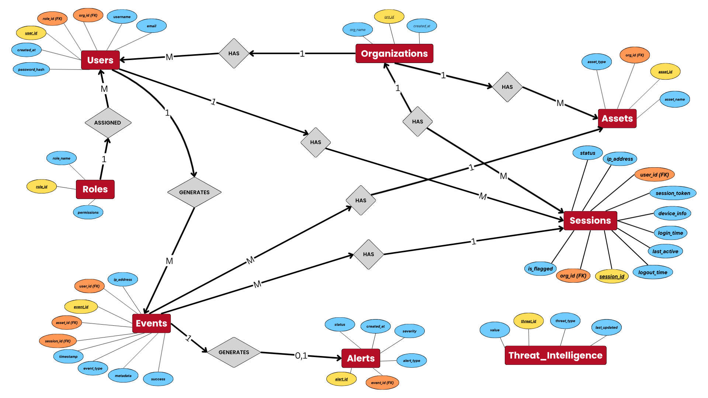

# 🛡️ ThreatLens

ThreatLens is a robust, database-driven cybersecurity monitoring system designed to help organizations manage users, track activity, and identify security threats in real time. Developed as a DBMS course project, it demonstrates practical applications of advanced database concepts in a real-world cyber defense scenario.

---

## 🚀 Main Features

- **Organization & User Management:** Supports multi-tenant organizations, user registration, roles, and permissions.
- **Security Event Logging:** Automatically records key actions and access events for forensic analysis.
- **Session Monitoring:** Tracks logins, sessions, and detects unusual or suspicious user behavior.
- **Threat Detection:** Flags off-hours logins, suspicious IPs, privilege escalations, concurrent sessions, and unauthorized access.
- **Alerts System:** Raises and manages alerts for critical security incidents.
- **Analytical Queries:** Provides insights into security trends and user activity.

---

## 🛠️ Tech Stack

- **Backend:** Python (Flask)
- **Database:** PostgreSQL
- **ORM/Database Access:** `psycopg2`
- **Security:** Password hashing with bcrypt, role-based access control
- **Other:** Uses .env variables for secure configuration

---

## 📦 Project Structure

```
ThreatLens/
│
├── backend/
│   ├── app.py              # Flask app entry point
│   ├── db.py               # Database access
│   ├── routes/             # API routes for events, orgs, sessions, auth, threats
│   ├── requirements.txt    # Python dependencies
├── database/
│   ├── schema.sql          # Full relational schema & DDL
│   ├── triggers.sql        # Automated DB triggers
│   ├── queries.sql         # Complex DML/analytical queries
│   ├── seed_data.sql       # Sample data for testing
├── Files/
│   ├── ThreatLens_ERD.png  # Database Entity-Relationship Diagram
│   ├── (other docs & workflow diagrams)
├── README.md
```

---

## 🏗️ Database Design Highlights

- **Fully Normalized Schema:** Covers organizations, users, roles, assets, sessions, events, alerts, and audit logs.
- **Triggers & Automation:** Automatically logs and audits alert status changes, keeps login attempts synced.
- **Rich Event Metadata:** Captures all relevant context for security investigations.
- **Sample Data & Analytical Queries:** Provided to demonstrate practical use cases.

---

## ⚡️ Getting Started

1. **Clone the Repo:**  
   `git clone https://github.com/Usman-Azhar/ThreatLens.git`

2. **Set up the Database:**  
   - Ensure PostgreSQL is running.
   - Execute `database/schema.sql`, `database/triggers.sql`, `database/seed_data.sql` to create tables and insert data.

3. **Configure Environment Variables:**  
   - Edit `backend/Credentials.env` for DB connection settings.

4. **Install Python Dependencies:**  
   ```
   cd backend
   pip install -r requirements.txt
   ```

5. **Run the Server:**  
   ```
   python app.py
   ```
   App runs by default on [http://localhost:5000](http://localhost:5000).

---

## 🖼️ Visuals

- **Database ER Diagram:**  
  

- **Complete Workflow:**  
  _See PDF in `Files/ThreatLens_Complete_Workflow.pdf`_

---

## 📑 Documentation

- Refer to `Files/ThreatLens.docx` for the complete project report
- Workflow: `Files/ThreatLens_Complete_Workflow.pdf`
- Data Samples: `Files/USERS.xlsx`

---

## ❤️ Credits

Developed by [Usman Azhar](https://github.com/Usman-Azhar) as a university DBMS project.

---
