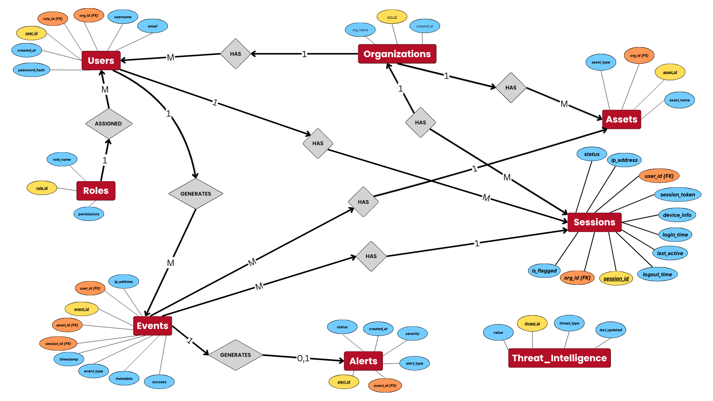

# 🛡️ ThreatLens

> **A Comprehensive Cybersecurity Monitoring & Threat Detection Platform**
>
> A practical learning project exploring real-time security event logging, behavioral anomaly detection, and intelligent threat identification through database design and backend development.

---

## 📋 Table of Contents

- [Project Overview](#-project-overview)
- [The Problem We're Solving](#-the-problem-were-solving)
- [Our Approach](#-our-approach)
- [Key Features](#-key-features)
- [Tech Stack](#️-tech-stack)
- [How It's Built](#-how-its-built)
- [Database Design](#-database-design)
- [Getting Started](#-getting-started)
- [API Documentation](#-api-documentation)
- [What We Learned](#-what-we-learned)
- [Meet the Team](#-meet-the-team)
- [About This Project](#-about-this-project)

---

## 📚 Project Overview

**ThreatLens** is a 4th-semester Database Management Systems (DBMS) capstone project from **Ghulam Ishaq Khan Institute of Engineering Sciences and Technology**. 

We built this platform to explore how databases power real-world security applications. Instead of just studying theory, we designed a relational database system that actually detects threats, logs events, and manages users—exactly how enterprise security teams work.

This project combines database design principles, backend API development, and security best practices into one cohesive learning experience.

---

## 🔴 The Problem We're Solving

Imagine you're running an organization and you have no way to see what's happening:

- **No Visibility** – You don't know who logged in when, or from where
- **Slow Detection** – By the time you realize something's wrong, it's too late
- **Missing Evidence** – When a security incident happens, you can't investigate because there's no trail
- **Invisible Red Flags** – Unusual login times, strange IP addresses, privilege escalations—all happening in the dark
- **Chaos at Scale** – Managing users across multiple departments with different roles gets messy fast

This is what we wanted to solve: **How do we build a system that watches everything, learns what's normal, and alerts us when something's wrong?**

---

## ✅ Our Approach

We tackled this through **proper database design** and **intelligent monitoring logic**:

| Challenge | How We Solved It |
|-----------|-----------------|
| No visibility into user activity | Built comprehensive event logging connected to real user sessions |
| Threats go unnoticed | Created automated alert rules that flag suspicious patterns |
| Can't investigate incidents | Designed immutable audit logs that capture every change |
| Don't know what's "normal" | Implemented behavioral analysis (off-hours logins, IP mismatches, etc.) |
| Managing multiple organizations | Used relational design with proper role-based access control |

**The Result:** A system that doesn't just store data—it *understands* security.

---

## 🚀 Key Features

### 🔐 **What the System Can Do**

**🏢 Organization & User Management**
- Support multiple organizations completely isolated from each other
- Role-based access control (RBAC) so each person has exactly the permissions they need
- Secure user registration with bcrypt password hashing (no plaintext passwords!)

**📊 Real-time Event Logging**
- Every important security action gets logged automatically
- Rich metadata captured for investigation (who did it, when, from where)
- Immutable logs—once written, they can't be changed or deleted

**👤 Session Monitoring**
- Track every login and active session
- Detect when the same user is logged in from impossible locations at the same time
- Manage session timeouts and automatic logouts

**🚨 Smart Threat Detection**
- **Off-Hours Alerts** – Flag logins happening at 3 AM when nobody should be working
- **Location Anomalies** – User logged in from New York at 2 PM, then Tokyo at 2:15 PM? That's impossible!
- **Privilege Changes** – Track when users get new permissions or lose access
- **Concurrent Sessions** – Catch when someone's account is being used in multiple places
- **Access Control** – Verify permissions before letting anyone do anything

**🔔 Alert Management**
- Automatic alerts when threats are detected
- Track whether alerts are still open, being investigated, or resolved
- Full history of every alert change (another audit trail!)

**📈 Security Analytics**
- Query the database for trends and patterns
- Build user behavior profiles
- Categorize incidents by risk level

---

## 🛠️ Tech Stack

We chose technologies that are industry-standard and what we're learning in class:

| Component | Technology | Why We Chose It |
|-----------|-----------|-----------------|
| **Backend** | Python 3.x + Flask | Easy to learn, great for APIs |
| **Database** | PostgreSQL | Enterprise-grade relational DB, free, powerful |
| **Database Driver** | psycopg2 | Direct connection to PostgreSQL |
| **Security** | bcrypt | Industry standard for password hashing |
| **Config** | Environment variables (.env) | Keeps secrets safe outside the code |

---

## 🏗️ How It's Built

```
ThreatLens/
│
├── 📁 backend/                     # The application logic
│   ├── app.py                      # Main entry point
│   ├── db.py                       # Database connection & queries
│   ├── routes/                     # API endpoints
│   │   ├── auth_routes.py         # Register & login
│   │   ├── org_routes.py          # Manage organizations
│   │   ├── user_routes.py         # Manage users
│   │   ├── event_routes.py        # Log & retrieve security events
│   │   ├── session_routes.py      # Track active sessions
│   │   └── threat_routes.py       # Detect threats & create alerts
│   ├── requirements.txt            # Python packages we need
│   └── Credentials.env             # Database login (don't commit this!)
│
├── 📁 database/                    # The database structure
│   ├── schema.sql                 # Database tables & relationships
│   ├── triggers.sql               # Automation rules in the database
│   ├── queries.sql                # Pre-built analysis queries
│   └── seed_data.sql              # Sample data for testing
│
├── 📁 Files/                       # Documentation & visuals
│   ├── ThreatLens_ERD.png         # How the database tables connect
│   ├── ThreatLens_Complete_Workflow.pdf
│   ├── ThreatLens.docx            # Full technical report
│   └── USERS.xlsx                 # Example datasets
│
└── README.md                       # You're reading this!
```

---

## 💾 Database Design

### **The Core Tables**

We designed our database around these key entities:

- **Organizations** – Each company is separate (multi-tenant design)
- **Users** – Employee profiles with authentication details
- **Roles & Permissions** – Fine-grained access control (not just "admin" or "user")
- **Assets** – The resources being protected (servers, files, etc.)
- **Sessions** – Who logged in, when, and from where
- **Security Events** – Everything that happens (logins, file access, permission changes)
- **Alerts** – Threats we've detected and flagged
- **Audit Logs** – A permanent record of every database change

### **Smart Automation with Triggers**

Instead of writing code to update everything manually, we used **database triggers**:

- When someone logs in → automatically create a session record
- When we see suspicious activity → automatically create an alert
- When an alert status changes → automatically log that change
- These triggers ensure nothing is forgotten and everything is consistent

### **The Relationships**

Everything connects for a complete picture:
- A session connects a user to a login event
- A login event connects to security events that happened during that session
- An alert connects to the events that triggered it
- Audit logs track when alerts change status

**Visual Representation:**  


---

## ⚡ Getting Started

### **What You'll Need**
- Python 3.7 or newer
- PostgreSQL 12 or newer  
- Git (to clone the repo)
- A text editor or IDE (VS Code, PyCharm, etc.)

### **Installation Steps**

**Step 1: Get the Code**
```bash
git clone https://github.com/Usman-Azhar/ThreatLens.git
cd ThreatLens
```

**Step 2: Set Up the Database**
```bash
# Create a new database
createdb threatlens

# Load the database structure
psql -U your_username -d threatlens -f database/schema.sql

# Add the automation rules (triggers)
psql -U your_username -d threatlens -f database/triggers.sql

# Load some example data for testing
psql -U your_username -d threatlens -f database/seed_data.sql
```

**Step 3: Configure Your Credentials**
```bash
# Copy the template
cp backend/Credentials.env.example backend/Credentials.env

# Edit Credentials.env and add your database details:
# DB_HOST=localhost
# DB_PORT=5432
# DB_NAME=threatlens
# DB_USER=your_username
# DB_PASSWORD=your_password
```

**Step 4: Install Python Libraries**
```bash
cd backend
pip install -r requirements.txt
```

**Step 5: Start the Server**
```bash
python app.py
```

Your application is now running at **http://localhost:5000** 🎉

---

## 📚 API Documentation

Here's what you can do with the API:

| What You Want | Endpoint | Method |
|---------------|----------|--------|
| Create a new account | `/api/auth/register` | POST |
| Log in | `/api/auth/login` | POST |
| View/create organizations | `/api/organizations` | GET/POST |
| Manage users | `/api/users` | GET/POST |
| Log security events | `/api/events` | GET/POST |
| Check active sessions | `/api/sessions` | GET |
| View detected threats | `/api/threats` | GET |

Each endpoint returns clear responses with status codes that tell you if something worked or what went wrong.

---

## 📖 Documentation

If you want to dive deeper:

| Document | Location | Contains |
|----------|----------|----------|
| **Full Project Report** | `Files/ThreatLens.docx` | Everything we learned and did |
| **System Workflows** | `Files/ThreatLens_Complete_Workflow.pdf` | Architecture diagrams and data flow |
| **Database Definition** | `database/schema.sql` | The exact SQL table definitions |
| **Test Data** | `Files/USERS.xlsx` | Example data to experiment with |

---

## 🎯 Real-World Applications

This isn't just a school project—here's how organizations actually use systems like this:

✅ **Security Teams** – Monitor what employees access and when  
✅ **Compliance Officers** – Generate audit reports for regulatory requirements  
✅ **Incident Response** – When something goes wrong, investigate using complete logs  
✅ **System Admins** – Track who changed what permissions  
✅ **Internal Auditors** – Verify that security controls are actually working  

---

## 🚀 What's Next?

If we were to keep developing this, here's what we'd add:

- [ ] Machine learning to detect truly weird patterns (not just rule-based alerts)
- [ ] Beautiful dashboard with graphs and real-time updates
- [ ] Connect to professional SIEM (Security Information & Event Management) platforms
- [ ] Push notifications to phones when critical threats appear
- [ ] Smarter threat correlation (connecting related events automatically)
- [ ] Automated response actions (block IPs, lock accounts, etc.)

---

## 👥 Meet the Team

We're three CS students from GIKIST who built this together:

<table>
<tr>
<td align="center">
<a href="https://github.com/Usman-Azhar">
<br />
<sub><b>Usman Azhar</b></sub></a><br />
<sub>58 commits</sub><br />
<sup>Database Architecture & Backend</sup>
</td>
<td align="center">
<a href="https://github.com/fatimaalli">
<br />
<sub><b>Fatima Alli</b></sub></a><br />
<sub>25 commits</sub><br />
<sup>Frontend & User Interface</sup>
</td>
<td align="center">
<a href="https://github.com/GhostByte101">
<br />
<sub><b>GhostByte101</b></sub></a><br />
<sub>21 commits</sub><br />
<sup>Security Implementation & Testing</sup>
</td>
</tr>
</table>

---

## 📚 About This Project

**What** – A cybersecurity threat detection platform built on a relational database  
**Why** – To learn how databases power real-world applications  
**When** – 4th Semester, 2025-2026 Academic Year  
**Where** – Ghulam Ishaq Khan Institute of Engineering Sciences and Technology (GIKIST)  
**Course** – Database Management Systems (DBMS)  
**Type** – Capstone Project

### **What We Learned**

✨ How to design databases that actually solve problems (not just store data)  
✨ Normalization, primary keys, foreign keys, and relational integrity  
✨ Database triggers and automation rules  
✨ Building APIs that talk to databases safely  
✨ Security practices (password hashing, access control, audit logging)  
✨ How enterprise applications really work behind the scenes  

---

## 📄 License

This project is shared for educational purposes. Feel free to learn from it, improve it, and adapt it for your own projects.

---

**🛡️ ThreatLens – Built by Students, Inspired by Real Security Challenges**

*Made with ❤️ at GIKIST*
